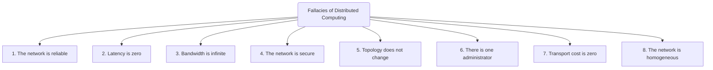
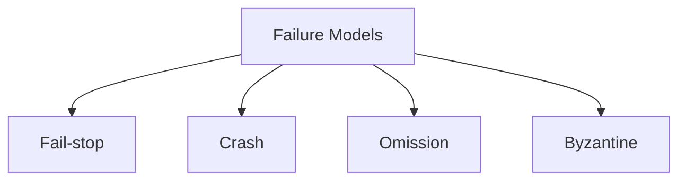
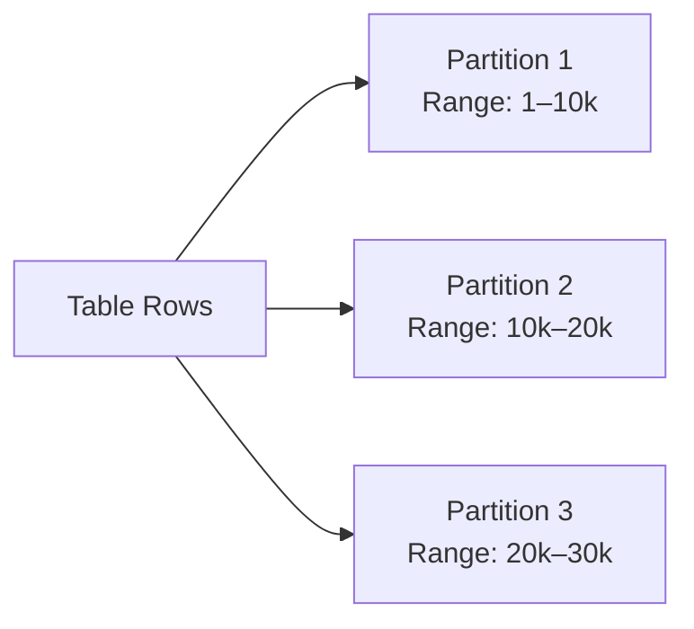
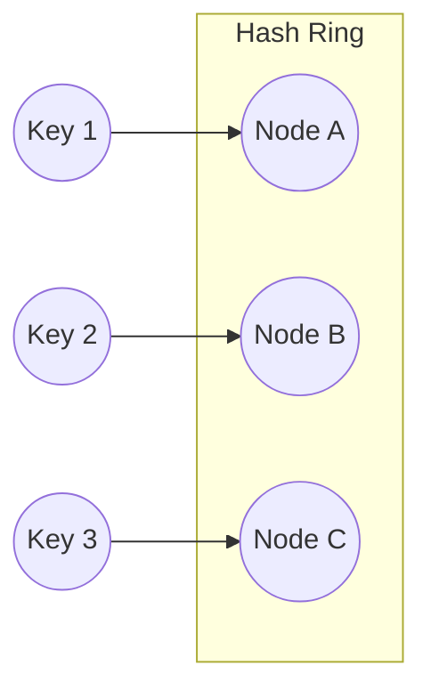

# Distributed Systems — Study Notes

## What Is a Distributed System?
A **distributed system** is a software system whose components run on multiple networked computers.  
These components **communicate and coordinate** by exchanging messages, working together to appear as a single system to the user.

### Key Characteristics
- Components run on **different machines**
- Operate through **message passing**
- Work together to achieve **common goals**
- Often transparent to users (behave like one unified system)

---

## Benefits of Distributed Systems

### 1. Performance
Distributed systems can parallelize tasks across multiple nodes.  
This reduces latency for large computations and allows heavy workloads to be split efficiently.

### 2. Scalability
You can horizontally scale by **adding more machines**, enabling the system to handle:
- More users  
- Higher data volume  
- Larger computational tasks  

### 3. Availability
Because components are replicated across machines, the system continues operating even when some nodes fail.

> **Note:**  
> “Five-nines availability” (99.999%) means the system can be down for **~5 minutes per year**.  
This is a common target for mission-critical systems.

| Availability Level | Percentage | Maximum Downtime/Year |
|-------------------|------------|------------------------|
| 3-nines           | 99.9%      | ~8.76 hours            |
| 4-nines           | 99.99%     | ~52 minutes            |
| 5-nines           | 99.999%    | ~5 minutes             |

---

## Fallacies of Distributed Computing
These are **common but false assumptions** developers make when designing distributed systems.  
Believing these leads to bugs, failures, and incorrect system architecture.



# Challenges and Core Properties of Distributed Systems

## Why Distributed Systems Are Hard
Distributed systems face complexity due to three fundamental realities:

### 1. Network Asynchrony
Messages may arrive late, out of order, or not at all.  
There is **no global clock**, and components cannot reliably know each other’s timing.

### 2. Partial Failures
In a distributed setup, a component may fail **independently** while others keep running.  
This makes failure detection and recovery extremely difficult.

### 3. Concurrency
Multiple nodes execute simultaneously.  
Their interactions can lead to race conditions, inconsistent states, and coordination challenges.

> **Callout — Key Insight**  
> In distributed systems, **anything that can go wrong will go wrong independently**, and the system must still continue to function.

---

## System Correctness

Correctness in distributed computing is defined using two dimensions:

### **Safety**
A safety property states that **something bad should never happen**.  
Examples:
- No two nodes elect themselves as the leader
- Money should never be deducted twice
- A message should never be delivered in the wrong order

Safety violations are **catastrophic**.

### **Liveness**
A liveness property states that **something good must eventually happen**.  
Examples:
- A leader must eventually be elected
- A client request must eventually receive a response
- A message must eventually be delivered

Liveness violations indicate **stuck or deadlocked systems**.

---

## Properties of Distributed Systems
Every distributed system must define:

### 1. How Nodes Interact
- Message passing protocols  
- Ordering guarantees  
- Synchronization mechanisms  

### 2. How Nodes Can Fail
Failure modes determine what guarantees the system must provide.

---

# Categories of Distributed Systems

## Synchronous Systems
Assume:
- Fixed upper bounds on message delay  
- Known execution speed  
- Reliable clocks  

> Rare in real-world systems; used mostly for theoretical guarantees.

## Asynchronous Systems
Assume:
- **No timing guarantees**  
- Messages may be delayed indefinitely  
- Failures may not be detectable  

> **Real distributed systems are asynchronous**.

---

# Failure Models in Distributed Systems

| Failure Type | Description | Detectable? | Severity |
|--------------|-------------|-------------|----------|
| **Fail-stop** | Node halts with error; others know it failed | Yes | Low |
| **Crash** | Node halts silently | No | Medium |
| **Omission** | Node fails to respond or drops messages | Partially | High |
| **Byzantine** | Node behaves arbitrarily, possibly maliciously | No | Highest |


# Partitioning — Detailed Study Notes

Partitioning is a technique used in distributed systems to split a large dataset into smaller pieces that can be stored and processed across multiple nodes, improving scalability, performance, and availability.

---

# 1. Overview of Partitioning

Partitioning divides a dataset into smaller, independent datasets to achieve:

- Improved scalability
- Increased read/write throughput
- Distributed storage across multiple machines
- Reduced hotspots
- Improved fault isolation

Types of partitioning:
- Vertical Partitioning
- Horizontal Partitioning

---

# 2. Vertical Partitioning

Vertical partitioning splits a table by columns.

## 2.1 Definition
- A table is divided into multiple tables that contain subsets of columns.
- Frequently accessed columns can be isolated.
- Less frequently accessed or large data fields can be placed separately.
- Full record reconstruction requires JOIN operations.

## 2.2 Advantages
- Improves query performance for column-specific workloads.
- Reduces amount of data scanned.
- Improves cache efficiency.
- Helps normalization.

## 2.3 Disadvantages
- Full-record queries require joins.
- Cross-node joins cause network overhead.
- Increases query complexity.

## 2.4 Mermaid Diagram — Vertical Partitioning

```mermaid
flowchart LR
    A[Users Table] --> B[Users_Core\n(id, name, email)]
    A --> C[Users_Metadata\n(id, profile_pic, preferences)]
```

---

# 3. Horizontal Partitioning

Horizontal partitioning splits a table by rows, distributing subsets of rows across different partitions or shards.

## 3.1 Definition
- Each partition contains the same columns but different rows.
- Data is assigned to partitions based on a strategy such as range, hash, or consistent hashing.
- Common in large-scale distributed systems such as Cassandra, BigTable, HBase, DynamoDB.

## 3.2 Advantages
- Enables linear scalability by adding nodes.
- Reduces per-node storage and load.
- Supports massive datasets.

## 3.3 Disadvantages
- Range queries may be inefficient depending on the strategy.
- No cross-shard atomic transactions without complex coordination.
- Rebalancing is expensive for some methods.

---

# 4. Types of Horizontal Partitioning

The main strategies are:

- Range Partitioning
- Hash Partitioning
- Consistent Hashing

---

# 4.1 Range Partitioning

## 4.1.1 Definition
Rows are partitioned based on contiguous key ranges.

Example:
- Partition 1 → keys 1–10,000
- Partition 2 → keys 10,001–20,000

## 4.1.2 Used In
- Google BigTable
- Apache HBase

## 4.1.3 Advantages
- Efficient range queries.
- Natural locality for related data.
- Works well for time-series and sequential workloads.

## 4.1.4 Disadvantages
- Leads to hotspots if certain ranges receive more traffic.
- Requires manual or automated splitting and rebalancing.
- Skewed distribution when data is uneven.

## 4.1.5 Mermaid Diagram — Range Partitioning



---

# 4.2 Hash Partitioning

## 4.2.1 Definition
Rows are assigned to partitions using a hash function:

```
partition = hash(key) % N
```

## 4.2.2 Advantages
- Uniform distribution of data.
- Avoids hotspots common in range partitioning.
- Simple implementation.

## 4.2.3 Disadvantages
- Poor performance for range queries because data is scattered.
- Adding or removing nodes requires repartitioning and moving many keys.
- Rebalancing cost increases with cluster size.

## 4.2.4 Mermaid Diagram — Hash Partitioning

```mermaid
flowchart LR
    K[hash(key)] --> P0[Partition 0]
    K --> P1[Partition 1]
    K --> P2[Partition 2]
```

---

# 4.3 Consistent Hashing

## 4.3.1 Definition
Consistent hashing maps nodes and data to positions on a logical hash ring.
Each key is assigned to the next clockwise node on the ring.

## 4.3.2 Advantages
- Minimal data movement during scaling.
- Supports dynamic node addition/removal.
- Virtual nodes improve load balancing.

## 4.3.3 Disadvantages
- Without virtual nodes, distribution may be uneven.
- More complex implementation than modulo hashing.

## 4.3.4 Mermaid Diagram — Consistent Hashing Ring



---

# 5. Summary Comparison

| Partitioning Method | Splits By | Pros | Cons | Systems Using It |
|---------------------|-----------|------|------|------------------|
| Vertical Partitioning | Columns | Good cache usage, smaller tables | Joins required for full record | SQL Databases |
| Range Partitioning | Key ranges | Efficient range queries, locality | Hotspots, skew | BigTable, HBase |
| Hash Partitioning | Hash(key) | Even distribution | Poor range queries, expensive rebalancing | Cassandra, Dynamo-like systems |
| Consistent Hashing | Hash ring | Minimal data movement, good scaling | Needs virtual nodes for balance | DynamoDB, Redis Cluster |

---

# 6. When to Use Each Method

## Vertical Partitioning
- When certain columns are accessed much more frequently.
- When optimizing query performance for column subsets.

## Range Partitioning
- When range scans or sequential access are common.
- When keys naturally follow a time- or sequence-based pattern.

## Hash Partitioning
- When uniform distribution is needed.
- When access patterns are random or unpredictable.

## Consistent Hashing
- When cluster size changes often.
- When minimizing rebalance effort is critical.
- When building scalable distributed caches or databases.

---

# Replication

Replication is a technique used in distributed systems to increase data availability and fault tolerance by maintaining multiple copies of the same data across different nodes.

---

# 1. Purpose of Replication
- Increase availability
- Improve read scalability
- Provide fault tolerance
- Reduce latency (geo-distribution)

---

# 2. Types of Replication Strategies

## 2.1 Pessimistic Replication
- All replicas are identical to each other at all times.
- Strong consistency.
- Updates propagate immediately.
- Higher write latency.

## 2.2 Optimistic Replication
- Also called lazy replication.
- Replicas eventually converge to the same state.
- Eventual consistency.
- Faster writes, lower latency.

---

# 3. Primary–Backup Replication

Primary–backup (leader–follower) model:

- A leader (primary) handles all write requests.
- Followers handle read requests.
- Leader propagates updates to followers.

### Advantages
- Scalable for read-heavy workloads.

### Disadvantages
- Not ideal for write-heavy workloads.

---

# 4. Synchronous vs Asynchronous Replication

## 4.1 Synchronous Replication
- Update acknowledgment is sent to the client **only after** all replicas have acknowledged the update.
- High durability.
- Slower writes (wait for all nodes).

## 4.2 Asynchronous Replication
- Client receives acknowledgment immediately after the local write.
- Faster writes.
- Lower consistency & durability guarantees.

---

# 5. Failover

Failover occurs when the leader node crashes.

- A follower takes over as the new leader.
- Can be manual or automatic.

---

# 6. Multi-Primary Replication

- All replicas accept write requests.
- Availability prioritized over consistency.
- Conflicting data may arise due to different execution orders on different nodes.

## 6.1 Eager Conflict Resolution
- Conflicts resolved during the write operation.

## 6.2 Lazy Conflict Resolution
- Conflicts resolved during subsequent reads.

### Approaches to Conflict Resolution
- Exposing conflict to the client.
- Last write wins (latest timestamp wins).
- Causality tracking.

---

# 7. Quorum-Based Replication

Quorum ensures a minimum number of nodes participate in read and write operations to maintain consistency.

Definitions:
- **Vr** = Read quorum size
- **Vw** = Write quorum size
- **V** = Total number of replicas

## Rules
- **Vr + Vw > V** → Ensures no simultaneous conflicting read/write of the same data item.
- **Vw > V/2** → Ensures at least one node receives both write operations and imposes an order.

---

# Consistency Models

Consistency models define the rules for how operations appear and behave in a distributed system.

---

# 1. Consistency Model (General Definition)

A **consistency model** defines the set of guarantees a distributed system provides about the visibility and ordering of read and write operations across nodes.

---

# 2. Types of Consistency Models

## 2.1 Linearizability (Strongest Practical Model)
- Operations appear **instantaneous** to external clients.
- Every operation seems to occur at a single point in time between invocation and response.
- Guarantees real-time ordering.
- Easiest for developers to reason about; hardest to scale.

---

## 2.2 Sequential Consistency
- All clients observe the **same order** of operations.
- Per-client program order is preserved.
- Does **not** guarantee real-time ordering.
- Weaker than linearizability but stronger than causal consistency.

---

## 2.3 Causal Consistency
- Operations with **causal relationships** must be seen in the same order.
- Concurrent operations (no causal link) may be seen in different orders.
- A → B must be preserved if:
  - A happens before B
  - B observes A
  - Client sees A then performs B

---

## 2.4 Eventual Consistency
- System guarantees only that replicas **eventually converge** if no new writes occur.
- Reads may not return the latest writes.
- High availability and low latency.
- Used in Dynamo-style systems, Cassandra, Riak.

---

# 3. Strong vs Weak Consistency

## 3.1 Strong Consistency Model
- Prioritizes consistency over availability.
- During network partition, system chooses **CONSISTENCY** and may reject operations.
- Follows CAP theorem’s CP behavior.
- Example: Linearizability.

## 3.2 Weak Consistency Model
- Preserves availability even during network failures.
- Allows temporary inconsistency.
- Follows CAP theorem’s AP behavior.
- Example: Eventual Consistency.

---

# Isolation Levels

Database isolation levels define how concurrently executing transactions interact with each other, and what anomalies they may or may not allow.

---

# 1. Isolation Levels

## 1.1 Serializability
- Strongest isolation level.
- Concurrent transactions must yield the same result as if executed sequentially.
- Prevents all anomalies.

## 1.2 Repeatable Read
- Once data is read in a transaction, it cannot change during the transaction.
- Prevents non-repeatable reads.
- May allow phantom reads.

## 1.3 Snapshot Isolation
- Each transaction reads from a consistent snapshot of the database taken at its start.
- Commit succeeds only if no other transaction has modified the same data.
- Prevents many anomalies but not all (e.g., write skew).

## 1.4 Read Committed
- A transaction only reads committed data.
- Prevents dirty reads.
- Allows non-repeatable reads and phantom reads.

## 1.5 Read Uncommitted
- Lowest isolation level.
- Allows reading uncommitted data.
- Allows most anomalies.

---

# 2. Anomalies

## 2.1 Dirty Write (DW)
- A transaction overwrites data that another uncommitted transaction has written.

## 2.2 Dirty Read (DR)
- A transaction reads uncommitted data from another transaction.

## 2.3 Non-Repeatable Read / Fuzzy Read (FR)
- A transaction reads the same row twice and sees different values.

## 2.4 Phantom Read (PR)
- A transaction reads rows matching a condition.
- Another transaction inserts/deletes rows matching that condition before the first commits.

## 2.5 Lost Update (LU)
- Two transactions read the same value and both update it.
- One update overwrites the other.

## 2.6 Read Skew (RS)
- A transaction reads logically related data items but sees an inconsistent partial update.

## 2.7 Write Skew (WS)
- Two transactions read the same data but update disjoint parts.
- Can violate database constraints.

---

# 3. Which Isolation Levels Prevent Which Anomalies?

| Isolation Level     | Prevents                                   |
|----------------------|---------------------------------------------|
| Read Uncommitted     | DW                                          |
| Read Committed       | DW, DR                                      |
| Snapshot Isolation   | DW, DR, FR, LU, RS                          |
| Repeatable Read      | DW, DR, FR, LU, RS, WS                      |
| Serializability      | All anomalies                               |

---

## Serializability alone is not sufficient
- T1 - Get balance
- T2 - Withdraw
- T3 - Get balance

The execution is serializable as T1, T3, T2
We need strict serializability = serializability + linearizability
i.e transactions should be serializable and executed in real world order

