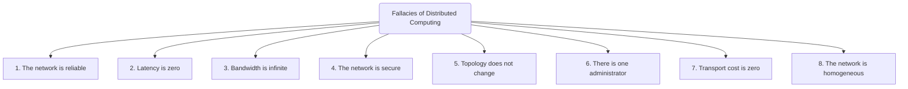
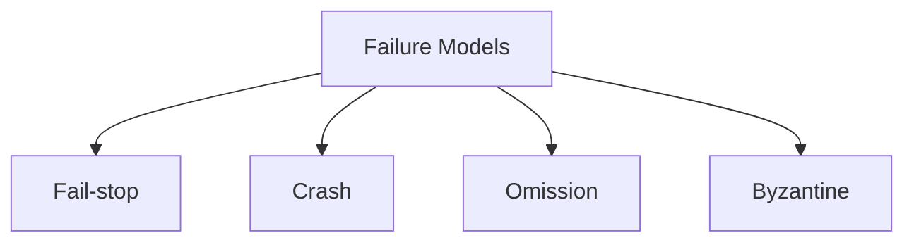

# Distributed Systems — Study Notes

## What Is a Distributed System?
A **distributed system** is a software system whose components run on multiple networked computers.  
These components **communicate and coordinate** by exchanging messages, working together to appear as a single system to the user.

### Key Characteristics
- Components run on **different machines**
- Operate through **message passing**
- Work together to achieve **common goals**
- Often transparent to users (behave like one unified system)

---

## Benefits of Distributed Systems

### 1. Performance
Distributed systems can parallelize tasks across multiple nodes.  
This reduces latency for large computations and allows heavy workloads to be split efficiently.

### 2. Scalability
You can horizontally scale by **adding more machines**, enabling the system to handle:
- More users  
- Higher data volume  
- Larger computational tasks  

### 3. Availability
Because components are replicated across machines, the system continues operating even when some nodes fail.

> **Note:**  
> “Five-nines availability” (99.999%) means the system can be down for **~5 minutes per year**.  
This is a common target for mission-critical systems.

| Availability Level | Percentage | Maximum Downtime/Year |
|-------------------|------------|------------------------|
| 3-nines           | 99.9%      | ~8.76 hours            |
| 4-nines           | 99.99%     | ~52 minutes            |
| 5-nines           | 99.999%    | ~5 minutes             |

---

## Fallacies of Distributed Computing
These are **common but false assumptions** developers make when designing distributed systems.  
Believing these leads to bugs, failures, and incorrect system architecture.

# Challenges and Core Properties of Distributed Systems

## Why Distributed Systems Are Hard
Distributed systems face complexity due to three fundamental realities:

### 1. Network Asynchrony
Messages may arrive late, out of order, or not at all.  
There is **no global clock**, and components cannot reliably know each other’s timing.

### 2. Partial Failures
In a distributed setup, a component may fail **independently** while others keep running.  
This makes failure detection and recovery extremely difficult.

### 3. Concurrency
Multiple nodes execute simultaneously.  
Their interactions can lead to race conditions, inconsistent states, and coordination challenges.

> **Callout — Key Insight**  
> In distributed systems, **anything that can go wrong will go wrong independently**, and the system must still continue to function.

---

## System Correctness

Correctness in distributed computing is defined using two dimensions:

### **Safety**
A safety property states that **something bad should never happen**.  
Examples:
- No two nodes elect themselves as the leader
- Money should never be deducted twice
- A message should never be delivered in the wrong order

Safety violations are **catastrophic**.

### **Liveness**
A liveness property states that **something good must eventually happen**.  
Examples:
- A leader must eventually be elected
- A client request must eventually receive a response
- A message must eventually be delivered

Liveness violations indicate **stuck or deadlocked systems**.

---

## Properties of Distributed Systems
Every distributed system must define:

### 1. How Nodes Interact
- Message passing protocols  
- Ordering guarantees  
- Synchronization mechanisms  

### 2. How Nodes Can Fail
Failure modes determine what guarantees the system must provide.

---

# Categories of Distributed Systems

## Synchronous Systems
Assume:
- Fixed upper bounds on message delay  
- Known execution speed  
- Reliable clocks  

> Rare in real-world systems; used mostly for theoretical guarantees.

## Asynchronous Systems
Assume:
- **No timing guarantees**  
- Messages may be delayed indefinitely  
- Failures may not be detectable  

> **Real distributed systems are asynchronous**.

---

# Failure Models in Distributed Systems

| Failure Type | Description | Detectable? | Severity |
|--------------|-------------|-------------|----------|
| **Fail-stop** | Node halts with error; others know it failed | Yes | Low |
| **Crash** | Node halts silently | No | Medium |
| **Omission** | Node fails to respond or drops messages | Partially | High |
| **Byzantine** | Node behaves arbitrarily, possibly maliciously | No | Highest |

